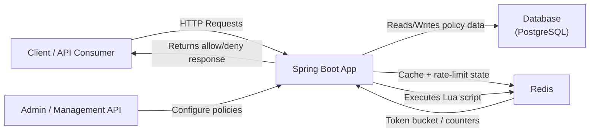
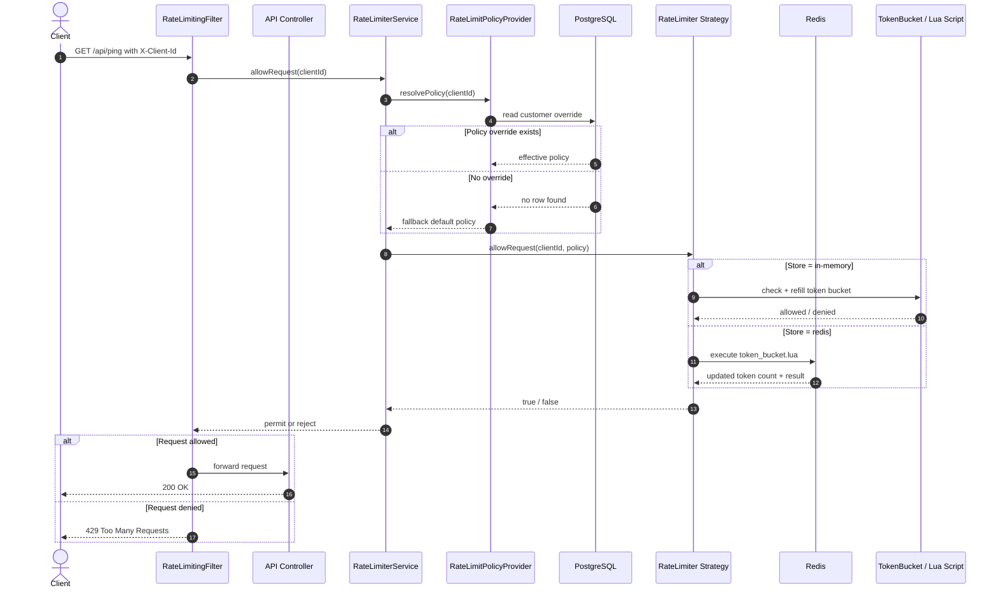

# API-Rate-Limiter

An API rate limiting service built with Java 21 and Spring Boot 4. The default policy is
configuration-owned, and customer-specific policy overrides are stored in PostgreSQL.

## Architecture



## Request flow



## Core API

```java
boolean allowRequest(String clientId)
```

Exposed via `RateLimiterService`. Returns `true` if the request is allowed under the client's
current policy, `false` if the client has exceeded its limit.

## How it works

- **Algorithm**: Token bucket per client (`TokenBucket`). Each client has a bucket that holds up
  to `maxRequests` tokens and refills continuously at `maxRequests / windowDuration`. This allows
  short bursts up to the configured maximum while enforcing a steady average rate.
- **Thread safety**: Each `TokenBucket` guards its state with a single `synchronized` method, so
  concurrent requests for the same client are serialized correctly. Buckets are stored in a
  `caffeine.cache.Cache<String, TokenBucket>`, which is safe for concurrent
  access across many different clients.
- **Bounded memory**: Buckets are evicted after `rate-limiter.bucket-eviction-duration` of
  inactivity (Caffeine `expireAfterAccess`), so memory does not grow indefinitely as new clients
  are seen. An evicted client simply gets a fresh, full bucket on its next request — this is safe
  (never more permissive than the configured rate over any window), just not persisted forever.
- **Per-client configuration**: `RateLimitPolicyProvider` resolves a policy per `clientId`,
  falling back to the YAML default when PostgreSQL has no customer-specific override. Admin API
  changes are durable. Each application instance caches override lookups for one second, so a
  change made through another instance can take up to one second to become visible locally.
- **Horizontal scaling**: `RateLimiter` is a Strategy interface. `TokenBucketRateLimiter` (in-memory,
  default) is limited to a single JVM. `RedisTokenBucketRateLimiter` shares bucket state across every
  application instance via Redis, so multiple instances behind a load balancer enforce one combined
  limit instead of each enforcing its own independent quota. Select it with `rate-limiter.store=redis`.
  All state mutation happens inside one atomic Lua script (`scripts/token_bucket.lua`) to avoid a
  read-modify-write race between concurrent instances; idle buckets expire via Redis key TTL, which
  bounds memory the same way the in-memory implementation evicts idle buckets.
- **Design patterns used**: `RateLimiterService` is a Facade over the `RateLimiter` strategy for the
  rest of the application.

## Configuration

The default policy is configured in `application.yml`:

```yaml
rate-limiter:
  # "in-memory" (default, single JVM only) or "redis" (shared state, required for horizontal scaling).
  store: in-memory
  default-policy:
    max-requests: 5
    window-duration: 1m
  bucket-eviction-duration: 1h
```

Customer-specific policies are stored in PostgreSQL table `rate_limit_policy`. Flyway creates the
table and adds `customerA` (100/min), `customerB` (1000/min), and `customerC` (10/sec) during the
initial migration. With no matching row, the YAML default is used.

PostgreSQL uses standard `spring.datasource.url`, `spring.datasource.username`, and
`spring.datasource.password` properties. The provided configuration accepts the matching
`SPRING_DATASOURCE_*` environment variables and defaults to a local `rate_limiter` database.
When `rate-limiter.store` is `redis`, Redis uses standard `spring.data.redis.host` /
`spring.data.redis.port` properties (defaults: `localhost` / `6379`).

### Logging

This application uses **SLF4J** with Spring Boot's default logging provider (Logback). The log level for the `com.ratelimiter` package is controlled via the `RATE_LIMITER_LOG_LEVEL` environment variable and defaults to `DEBUG`.

**Configuration:**
- The log level is set in `application.yml`:
  ```yaml
  logging:
    level:
      com.ratelimiter: ${RATE_LIMITER_LOG_LEVEL:DEBUG}
  ```
- To change the log level at runtime, set the `RATE_LIMITER_LOG_LEVEL` environment variable before starting the application:
  ```bash
  export RATE_LIMITER_LOG_LEVEL=INFO
  mvn spring-boot:run
  ```

**What is logged:**
- **INFO level**: Important events such as policy updates/removals and missing request headers
  - Example: `"Received policy update request for client X"`, `"Rate limit exceeded for client Y"`
- **DEBUG level** (default): Detailed tracking of rate-limit decisions for each request
  - Example: `"In-memory bucket allowed/rejected request for client Z"`

### Runtime admin API

Policies can be inspected and changed at runtime without a restart:

| Method | Path                          | Description                                  |
|--------|-------------------------------|-----------------------------------------------|
| GET    | `/api/rate-limits/{clientId}` | Get the effective policy for a client        |
| PUT    | `/api/rate-limits/{clientId}` | Set/override the policy for a client         |
| DELETE | `/api/rate-limits/{clientId}` | Remove the override, revert to default       |

Example:

```bash
curl -X PUT localhost:8080/api/rate-limits/customerD \
  -H "Content-Type: application/json" \
  -d '{"maxRequests": 500, "windowDuration": "PT1M"}'
```

### Demo protected endpoint

`GET /api/ping` is guarded by `RateLimitingFilter`, which identifies the caller via the
`X-Client-Id` header and returns `429 Too Many Requests` once the limit is exceeded:

```bash
curl -H "X-Client-Id: customerA" localhost:8080/api/ping
```

## Running

```bash
mvn spring-boot:run
```

### API documentation (Swagger UI)

Once the app is running, the interactive API docs are available at:

- Swagger UI: http://localhost:8080/swagger-ui.html
- OpenAPI JSON: http://localhost:8080/v3/api-docs

### Running multiple instances with Docker Compose

`docker-compose.yml` starts PostgreSQL, Redis, and one or more app instances configured with
`RATE_LIMITER_STORE=redis`. PostgreSQL holds durable customer policy overrides and Redis ensures
all instances share the same per-client quota:

```bash
docker compose up --build --scale app=3
```

Each replica gets a random host port (no fixed port mapping, to avoid conflicts when scaled).
Find them with:

```bash
docker compose ps
```

Requests to any replica for the same `X-Client-Id` count against the same shared limit, so hitting
different replicas in round-robin does not let a client exceed its configured rate.

## Testing

```bash
mvn test
```

Includes unit tests (domain validation, token bucket refill math, policy resolution), a
multi-threaded concurrency test asserting exactly `maxRequests` successes under concurrent load,
MockMvc tests for the admin API, and a full Spring Boot integration test reproducing the exact
Customer A/B/C scenarios from the requirements.

The HTTP integration tests use a PostgreSQL Testcontainer and require a running Docker daemon. The
Redis-backed rate limiter has its own tagged Testcontainers-based test
(`RedisTokenBucketRateLimiterTest`); execute it explicitly with:

```bash
mvn test -Dgroups=redis
```

## Assumptions & production notes

- **In-memory is the default store**, scoped to a single JVM instance. Switching to a
  horizontally-scaled deployment to the Redis store (`rate-limiter.store=redis`) is a
  configuration change, not a code change, thanks to the `RateLimiter` strategy interface.
- **Redis is a single point of failure/bottleneck once enabled**: This implementation targets a
  single Redis instance. Production use at larger scale would want Redis Cluster/Sentinel for availability.
- **Policy source of truth**: The default policy is loaded from YAML at startup. Customer-specific
  overrides are durable PostgreSQL records and survive restart. Changing the YAML default requires
  a deployment restart; separately running instances can serve a cached customer override for up
  to `rate-limiter.policy-cache-duration` after another instance changes it.
- **No authentication on the admin API**: `/api/rate-limits/**` has no access control in this
  exercise. Production use requires securing these endpoints (e.g. Spring Security with RBAC).
- **No request queueing**: Requests exceeding the limit are rejected immediately, there is no
  fairness queue or backoff/retry mechanism.
- **Monotonic clock**: The in-memory implementation uses `System.nanoTime()` (immune to wall-clock/
  NTP adjustments); the Redis implementation uses `System.currentTimeMillis()` from whichever
  instance handles the request, so significant clock drift between application hosts could skew
  refill timing slightly — acceptable for rate limiting, but worth running NTP in production.
